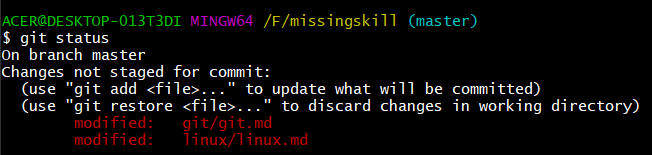

# 📌Introduction

**Git** is the most widely used `Open Source Distributed Version Control System`. To break down in simple terms :

- Version control - To track and manage the changes made in a code.
- Distributed Version Control - Version Control can be either Centralized or Distributed.
  In distributed, the code is present in central server as well as in all the developer's computer.

So, Git is used for tracking the changes that we make in our code, to revert back to previous versions that were made in the code and also allows multiple developers to collaborate and work together in parallel.

> ❗ _Examples of Centralized Version Control sytems are Subversion (SVN), Perforce, etc_

&nbsp;
[⬆️ back on top](#)

🔸 Branch

```
Branch is like a pointer that will always point to the last commit that is made in out repository.

By default git commits in master branch.

Multiple branches can be created to work in parallel.
```



&nbsp;
