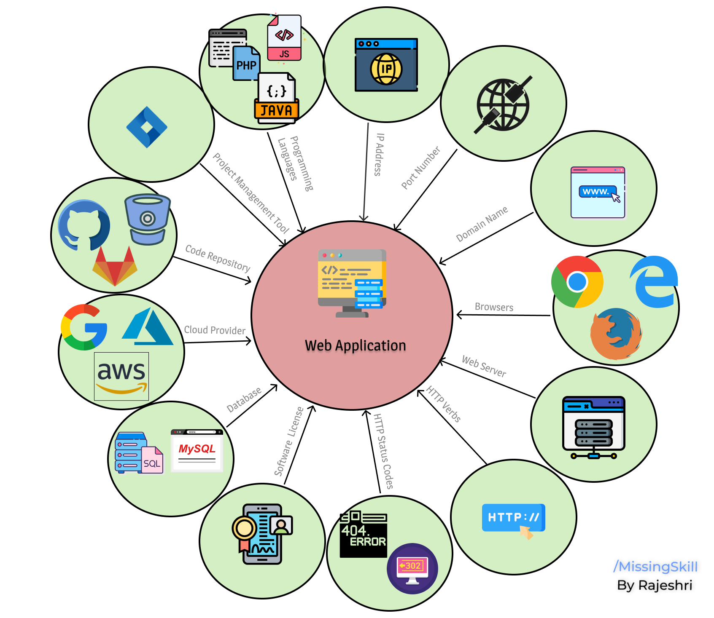
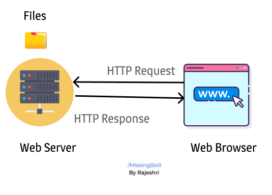

↩️ [Home directory](https://github.com/rajeshrideshmukh/missingskill-learning "Go to Home repository")

&nbsp;

# Basic Building Block of Web Application

  

## 📌 Programming languages

The purpose of language is to communicate just like humans interact with others through various human languages, we also neend some programming languages to communicate with computer since it does not understand human language.

Programming languages are set of instructions used to perfrom some task and are written in specific language like C++, Java, JavaScript, etc.

_Below is the list of some of the famous Programming languages :_

1.  JavaScript
2.  Swift
3.  Python
4.  Ruby
5.  Java
6.  C
7.  C++
8.  C#
9.  Go
10. PHP
11. Kotlin

&nbsp;

## 📌 IP Address

- IP Address stands for **Internet Protocol** Address.

- It is a string of numbers seperated by period/colon (./:) which are used to identify a specific computer network.

- Every device that is connected to the internet is assigned with a unique IP Address.

- They are allocated by the **_Internet Assigned Numbers Authority_** (IANA).

Versions :

| IPv4                                                                       | IPv6                                                                    |
| -------------------------------------------------------------------------- | ----------------------------------------------------------------------- |
| It is 32-bit address and can store 2^32 addresses (4 billion + addresses). | It is the most recent version of IP Address and follows 128-bit scheme. |
| Numbers in IPv4 are seperated by period.                                   | Numbers in IPv6 are seperated by period.                                |
| Example : 12.244.233.165                                                   | Example : 2001:0db8:0000:0000:0000:ff00:0042:7879                       |

## **IPv4 Classes**:

| Class   | Range     | Application                |
| ------- | --------- | -------------------------- |
| Class A | 0 - 127   | Reserved for Local system. |
| Class B | 128 - 191 | Used for Internet          |
| Class C | 192 - 223 | Local Network              |
| Class D | 224 - 239 | Not used/Reserved          |
| Class E | 240 - 255 | Not used                   |

> _❗ IP Address is like our **Building's address**. When someone wants to meet us they would need atleast our Building's address and it can take them till the gate of our building._

&nbsp;

## 📌 Port Number

- Port numbers are usually the entry point to the application.
- Range of Port number: 0 - 65535

| Range         | Application                                                        |
| ------------- | ------------------------------------------------------------------ |
| 0 - 1023      | Can not be used by application, this port is used only by system . |
| 1024 - 49150  | Used for running web application.                                  |
| 49151 - 65535 | They are open port and can be use by anyone.                       |

> _❗ Port number is like our **room number to our home**._

&nbsp;

## **Web Port**

Any web application running on server using ports - 80 & 443.

Port 80 is used by HTTP & 443 by HTTPS which provides secure connection.

&nbsp;

[⬆️ back on top](#basic-building-block-of-web-application)

&nbsp;
## 📌 Domain

- Domain name is basically what the users see on the browser's url bar.
- All computers are assigned a unique IP Address however it can be difficult to remember those everytime. Hence, domain names are used.
- Whenever user enters a domain name of a web page in the search bar, a request is sent to _**DNS**_ (Domain Name System) Server which in return looks up for the IP Address of that requested domain and makes that web page accessible to user. It is similar to giving directions of a particular address.
- Domain names are available in many different extensions. The most popular one is .com. There are many other options like .org, .net, .tv, .info, .io, etc.

  Some examples:

  | domain | Full-form                  |
  | ------ | -------------------------- |
  | .br    | Brazil                     |
  | .it    | Italy                      |
  | .pt    | Portugal                   |
  | .mx    | Mexico                     |
  | .cn    | China                      |
  | .ru    | Russia                     |
  | .in    | India                      |
  | .ca    | Canada                     |
  | .th    | Thailand                   |
  | .gov   | Government agencies        |
  | .edu   | Educational institutions   |
  | .org   | Organizations (non-profit) |
  | .mil   | Military                   |
  | .com   | commercial business        |
  | .net   | Network organizations      |

## Structure of a url:

    Example : https//www.domain-name.com

- https: Protocol
- www : Sub-domain
- domain-name : Domain-name
- .com : Top Level Domain
- domain-name.com : Root Domain

> _❗ If a website is considered as a house then the domain name is indicated as it's address_

&nbsp;

[⬆️ back on top](#basic-building-block-of-web-application)

&nbsp;
## 📌 Browsers

- Web browser is a software program which is primarily used for displaying and accessing websites on the internet.
- Web browsers work as part of a client/server model. The client is the browser which runs on the user’s device and makes requests to the Web server, while the server-side is the Web server which sends information back to the browser.
- The browser then interprets and displays the information on the user’s device.

  ## **Popular web browsers** :

  | Browser            | Information                                                                         |
  | ------------------ | ----------------------------------------------------------------------------------- |
  | Google Chrome      | Developed by Google                                                                 |
  | Firefox-           | Developed by Mozilla.                                                               |
  | Microsoft Edge-    | Used a replacement for Internet Explorer, with Windows 10.                          |
  | Internet explorer- | Developed by Microsoft                                                              |
  | Safari-            | A browser for Apple computers and mobile devices.                                   |
  | Lynx-              | A text-only browser for UNIX shell and VMS users.                                   |
  | Opera-             | A fast and stable browser that's compatible with most relatively operating systems. |

  &nbsp;

## 📌 Web Server

Web Server is an application where we host our websites. The main aim of Web Server is to respond to the client requests.

  

&nbsp;

## 📌HTTP Verbs

The set of common methods for HTTP is defined below

| Methods       | Information    |
| ------------- | -------------- |
| GET           | To get data    |
| POST          | To send data   |
| PUT           | To update data |
| DELETE        | To delete      |
| OPTION / HEAD | For queries    |

&nbsp;

## 📌 HTTP Status Code

| Range of Codes | Codes                                                                   | Information                                    |
| -------------- | ----------------------------------------------------------------------- | ---------------------------------------------- |
| 100 - 199      | 100 - continue                                                          | Informational Responses                        |
| 200 - 299      | 200 - ok 202 - accepted                                                 | Success resonse                                |
| 300 - 399      | 302 - not found                                                         | Used for redirecting or migration.             |
| 400 - 499      | 403 - forbidden 404 - not found 408 - request timeout                   | Used for client authentication and requirement |
| 500 series     | 500 - server internal error 503 - if server is down, sever unavailable. | Server error                                   |

&nbsp;

[⬆️ back on top](#basic-building-block-of-web-application)

&nbsp;
## 📌 Software License

- Licensing is very important in Software development. Software license provides rights to the end user stating that they can use as well as distribute the software without violating any copyrights.
- Open source license give rights to the customer. This means they can do modification and reuse of the software code and also provide the actual source code.
- Proprietary software license does not allow to copy, modify, or distribute the software. It protects the developer from unauthorized use of the software.

  Some Popular open source Licenses are :-

  - Apache 2.0
  - MIT
  - GPL
  - BSD
  - Mozilla

  > ❗ _Oracle filed a lawsuit against Google for stealing 11,330 lines of their Java code for creating Android and Google paid a penalty of $9 Billion_

&nbsp;

## 📌 Database

- Database is a collection data which is organized in such a way that data could be accessed and modified easily.

  Various types of databases are used for storing data:

  | Relational Database | Non-relational Database |
  | ------------------- | ----------------------- |
  | MySql               | MongoDB                 |
  | PostgreSQL          | Redis                   |
  | MariaDB             | Cassandra               |
  | Oracle Database     | Apache HBase            |

&nbsp;

## 📌 Cloud Provider

- Cloud Providers are the company which provides public cloud, manages private cloud and also provides various cloud computing services) like **_Infrastructure-as-a-Service_** (IaaS), **_Platform-as-a-Service_** (PaaS).

  Following are some of the famous cloud providers :

  - AWS
  - Google Cloud
  - Azure
  - Digital Ocean
  - Vultr
  - Heruko
  - Netlify

  &nbsp;

## 📌 Code Repository

- Code Repository is a place to store project files and it allows multiple developers to collaborate.
- Main aim of Code Repository is to provide collaboration, transparency and security.
- It makes sure that developers don't lose their code and also allows to save their work in remote and local repository.

  Following are some of the famous Code Repository :

  - GitHub

  - GitLab

  - BitBucket

  &nbsp;

## 📌 Project Management Tool

Project Management Tools are some tools that are used in organization to keep track of their projects and task.

- JIRA
- Trello
- Google sheets

&nbsp;

## 📌 Dev workflow

- Feature Branch -> Develop Branch -> Master Branch

  This is how the flow goes ..

  - Feature Branch : Developer develops all the feature in seperate feature branches.
  - Develop Branch : All the feature after being reviewed get merged into the develop branch if approved.
  - Master Branch : Final developments gets merged and gets deployed.

&nbsp;

## 📌 Infrastructure

- Development (Dev)
- User Acceptance Testing (UAT) / Staging
- Production System

  &nbsp;

&nbsp;

[⬆️ back on top](#basic-building-block-of-web-application)

↩️ [Home directory](https://github.com/rajeshrideshmukh/missingskill-learning "Go to Home repository")

&nbsp;
