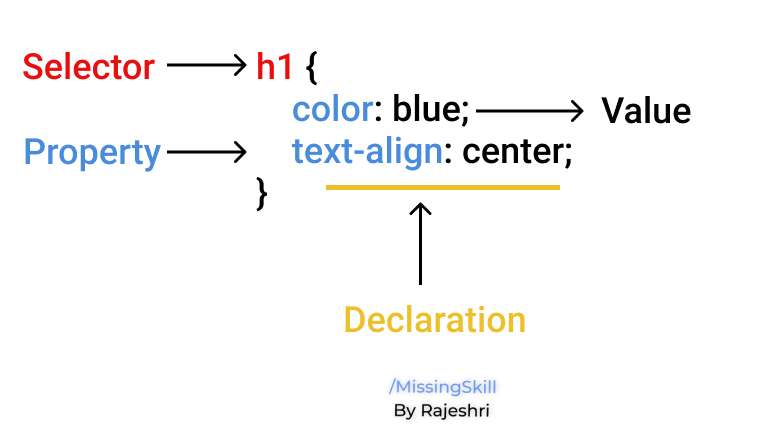

↩️ [Home directory](https://github.com/rajeshrideshmukh/missingskill-learning "Go to Home repository")

# 📌 HTML

HTML stands for **Hyper Text Markup Language**, it basically gives structure to your webpages. HTML is considered to be the foundation of your web page and it is one the core technology required to create webpages.

Example : 

```html

<!DOCTYPE html>
<html lang="en">
<head>
    <title>A simple HTML document</title>
</head>
<body>
    <p>Hello World!<p>
</body>
</html>

```

## Basic tags


Tag | Description | 
---------|----------|
 \<!DOCTYPE...\> | It defines the version of HTML | 
 |\<html\> |  Root tag that describes the whole page. We write everything inside these tags. | 
 |\<head\> |  Contains information about the document such as the title, author information, description of the webpage. | 
 |\<title\> |  Specifies the title of the document. | 
 |\<body\> |  Anything which we write in these tags is displayed on the webpage. | 
 |\<h1\> |  Used to define headings. \<h1\> is the largest heading, followed by \<h2\>, \<h3\>, to \<h6\>. | 


**HTML5**

This is the latest veersion of HTML and they have added many new  tags/features like :

Tag | Description
------- | -------
\<article\>  | Defines an article.
\<aside\>  | Defines some content loosely related to the page content.
\<video\> 	|Embeds video content in an HTML document.
\<audio\>  | Embeds a sound, or an audio stream in an HTML document.
\<embed\> 	| Embeds external application, typically multimedia content like audio or video into an HTML document.
\<figcaption\>  | Defines a caption or legend for a figure.
\<figure\>  | Represents a figure illustrated as part of the document.|
\<footer\>  | Represents the footer of a document or a section.
\<header\>  | Represents the header of a document or a section.
\<nav\>  | Defines a section of navigation links.
\<section\>  | Defines a section of a document, such as header, footer etc.
\<progress\>  | Represents the completion progress of a task.
\<svg\>  | Embed SVG (Scalable Vector Graphics) content in an HTML document.

<br>

[⬆️ back on top](#)

<br>

# 📌 CSS

CSS stands for Cascading Style Sheets. It is a style sheet  language which can be used to style an HTML document.

Syntax :

```css
   h1 {
        color: blue;
        text-align: center;
    }
```



The latest version of CSS is CSS3 which includes the many new features, some of them are explained below :

## Box Model

Every element that is displayed on a web page consists of some rectangular boxes. 
CSS box model typically describes how these rectangular boxes are displayed on the page. They have different properties like padding, border, and margin.

Example : 

```css
div {
    width: 10px;
    height: 500px;
    padding: 25px; /* gives padding for all four sides */
    border: 5px solid black; /* gives border for all four sides */
    margin: 10px auto; /* gives top and bottom margin to 20 pixels, and left and right margin to auto */
}

```

## Media Query

This is used for adapting to conditions such as screen resolution (e.g. Smartphone screen vs. computer screen). It customizes the presentation of your web pages for a specific range of devices like mobile phones, tablets, desktops, etc. without changing any code.

```css
/* Smartphones---------- */
@media screen and (max-width: 320px){
    /* styles */
}
/* Smartphones (portrait and landscape) ---------- */
@media screen and (min-width: 320px) and (max-width: 480px){
    /* styles */
}
/* Tablets, iPads (portrait and landscape) ---------- */
@media screen and (min-width: 768px) and (max-width: 1024px){
    /* styles */
}
```
## Background

Property | Description
------- | -------
background | A shorthand property for all the background-* properties
background-attachment | Sets whether a background image scrolls with the rest of the page, or is fixed
background-color | Specifies the background color of an element
background-image | Specifies one or more background images for an element
background-origin | Specifies the origin position of a background image
background-position | Specifies the position of a background image
background-repeat | Sets how a background image will be repeated

# 📌 Bootstrap

Bootstrap is the most popular framework used for front-end technologies like HTML, CSS, and JavaScript for faster and easier responsive web development. Bootstrap contains all custom jQuery plugins which we can directly use in our code.

The aim of Bootstrap is to create flexible and responsive web layouts with much less efforts. There are many predefined design templates and classes which saves lot of time and effort.

To use Bootstrap you need to either add their files in your folder or use an external CDN (Content Delivery Network) link. Bootstrap 5 is the lates version.

## Bootstrap Grid System

Grid systems creates page layouts through  number of rows and columns. This makes the websites responsive.


|Device size |  range
|------------------------|----------
Extra small|  \<576px
Small | >=576px
Medium | >=768px
Large | >=992px
Extra large | >=1200px

Classes | Description
------- | -------
.bg-danger | Gives red background color to an element.
.text-warning	| Yellow/orange text color. Indicates warning
.border-primary |	Adds a blue border to an element
.btn-light	| Light grey button
.col-\*\-\*	|Responsive grid (span 1-12 column)
.img-responsive	| Makes an image responsive
.mx-auto	| Centers an element horizontally
.navbar	| Creates a navigation bar
.pagination |	Creates a pagination
.w-25 .w-50 .w-75 .w-100 |	Sets the width of an element to 25%/50%/75%/100%
.table	| Adds basic styling to a table (padding, bottom borders, etc)		


[⬆️ back on top](#)


↩️ [Home directory](https://github.com/rajeshrideshmukh/missingskill-learning "Go to Home repository")