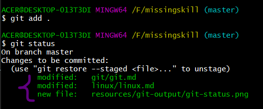

↩️ [Home directory](https://github.com/rajeshrideshmukh/missingskill-learning "Go to Home repository")

&nbsp;

# 📌Introduction

**Git** is the most widely used `Open Source Distributed Version Control System`. To break down in simple terms :

- Version control - To track and manage the changes made in a code.
- Distributed Version Control - Version Control can be either Centralized or Distributed.
  In distributed, the code is present in central server as well as in all the developer's computer.

So, Git is used for tracking the changes that we make in our code, to revert back to previous versions that were made in the code and also allows multiple developers to collaborate and work together in parallel.

> ❗ _Examples of Centralized Version Control sytems are Subversion (SVN), Perforce, etc_

&nbsp;

# 📌 Why to Use ?

> _(Compare the scenario before & after Git was developed )_

## 🔵 Before Git

- There was no commumnication between developers.
- All the code written by developers needed to be submitted to the server.
- It was not possible to track all the changes that other developers made and if in any condition they could not revert back to previous versions.
- Developers that are working in parallel can result in conflicts.

## 🔵 After Git

- Developers can regularly commumincate with each other and track all the changes made by them.
- They can revert back to previous versions. And can also store a copy of their code in the local system.
- Allows multiple developers to work together in parallel without any conflicts.

  &nbsp;

    

[⬆️ back on top](#)

&nbsp;

# 📌 Git Terminologies

> _If you're working with Git, you would come across the following terminologies:_

🔸 Repository

```
In simple terms, git repository is a folder/container to store all the project files and their previous versions.

All these files are present in .git/ (hidden folder)

        - Local repository : This is present in our local system and is used to work offline.
        - Remote repository : This refers to a server repository (Example - GitHub). It can be used by all the team members to track and make the changes in the code.

```

🔸 Branch

```
Branch is like a pointer that will always point to the last commit that is made in out repository.

By default git commits in master branch.

Multiple branches can be created to work in parallel.
```

🔸 Staging area

```
Staging area is a temporary space where the files are prepared for the next commit.
This is how git knows what changes are going to be made between current commit and next commit.
```

🔸 Commit

```
Commit is a process of adding the code from staging area to local repository.
```

🔸 Merge Conflict

```
Conflict occurs when git is not able to resolve the differences in the code between two commits.

Example - When two developers are making changes in same file and after one developer has push the file in remote repository,
other is trying to push it's modified file to remote repository which would result in conflict.
```

&nbsp;

# 📌 Git Commands

## Working with Local Repositories

&nbsp;

| Command      | Explanation                                                                                       |
| ------------ | :------------------------------------------------------------------------------------------------ |
| git config   | To configure username and user email                                                              |
| git init     | To create an empty repository                                                                     |
| git status   | To show the current state of repository                                                           |
| git add      | To add files in staging area                                                                      |
| git commit   | To save the changes in local repository                                                           |
| git branch   | To show the branch on which local repository is present                                           |
| git checkout | To switch between different branches, reciver deleted file and to revert back to previous version |
| git merge    | To combine the changes from one branch to another branch                                          |
| git log      | To show the order of the commit history for a repository                                          |

## Working with Remote Repositories

&nbsp;

| Command   | Explanation                                                                   |
| --------- | :---------------------------------------------------------------------------- |
| git clone | To download the remote repository into our local system                       |
| git pull  | To fetch and merge changes from the remote repository to the local repository |
| git push  | To push the content from the local repository to the remote repository        |

&nbsp;


## Some of the commands Performed:

- git status (Before committing)

    

- git add & git status

    

- git commit

    

- git push

    

- git branch & switch branch

    

    

- git checkout to recover deleted file

    

- git clone -

    
    

[⬆️ back on top](#)

↩️ [Home directory](https://github.com/rajeshrideshmukh/missingskill-learning "Go to Home repository")
