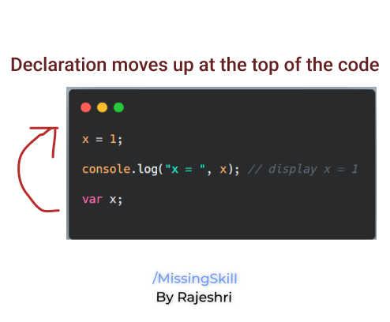
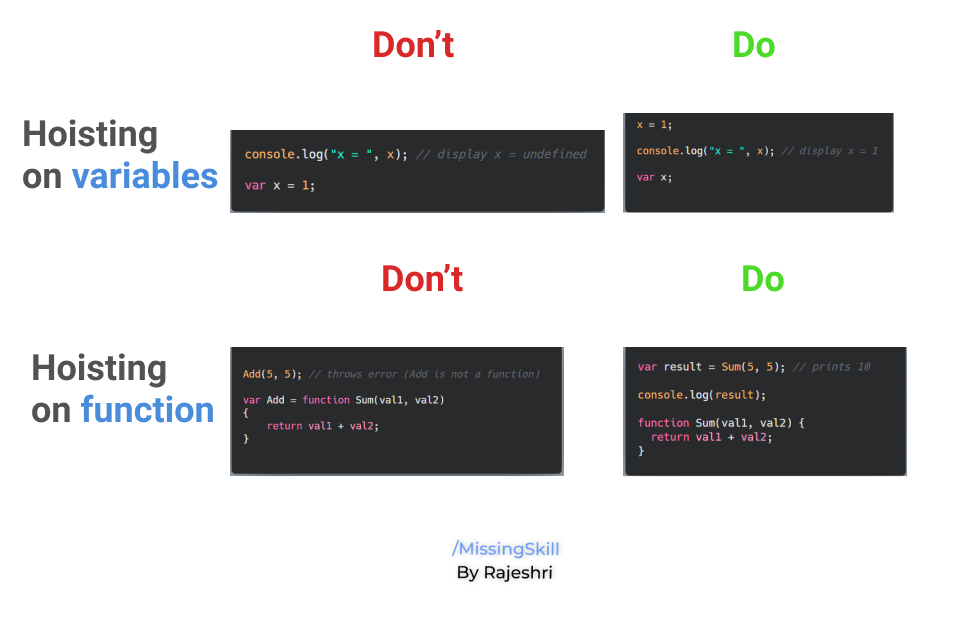
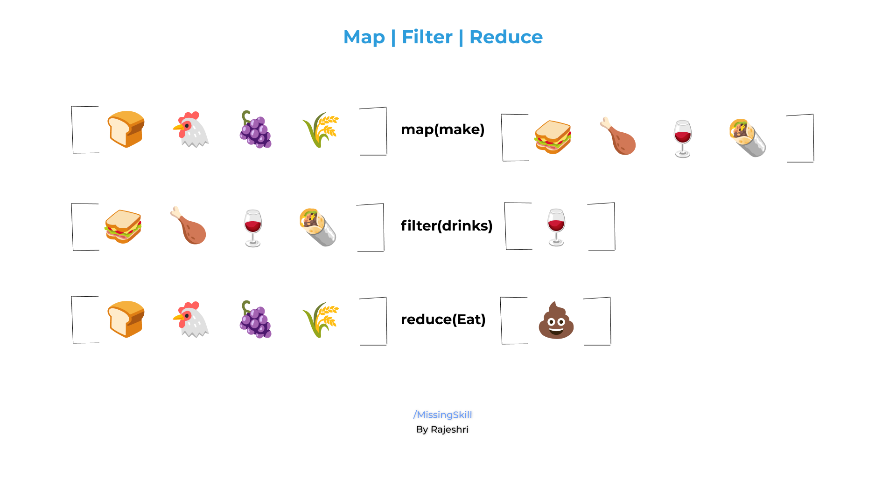

↩️ [Home directory](https://github.com/rajeshrideshmukh/missingskill-learning "Go to Home repository")

&nbsp;

# JavaScript Advance Concepts

## 📌 Scope
- Scope is basically the accessibility of variables, functions, and objects in your code. In simple terms, scope manages the availability of variables and defines what variables you can access.

1. **Global Scope**
   
   Whenever we declare a variable outside any function, it is said to have global scope. Such variables can be accessed and updated from any part of your code.

   ```javascript

    var value = "hello";
    console.log(value); // prints 'hello'

    function printValue() {
        console.log(value); // 'value' is accessible 
    }
   ```

2. **Local Scope**
   
   Opposite to Global scope, the variables that we declare inside any function are said to have local scope in that function. And those variables cannot be accessible outside. Because of this we can have multiple variables with same name but in different fucntions.   
   
    ```javascript

    function printValue() {
        var value = "hello";
        console.log(value); // prints 'hello' 
    }

    console.log(value); // ReferenceError: value is not defined

    ```
    In this case, JavaScript will ReferenceError: value is not defined.
    This is because printValue() has it's own scope for value variable. And because of this the variable could be accessed only in that scope.

3. **Lexical Scope**
   
   If we have nested functions, then the inner functions can have access to the variables of their parent scope. This is called Lexical Scope. This means that the child functions are lexically bound to the execution context of their parents.

   ```javascript

    function outer() {
    // the outer scope
    let outerVar = "I am from outside!";

    function inner() {
        // the inner scope
        console.log(outerVar); // 'I am from outside!'
    }

    return inner;
    }

    const result = outer();
    result();

   ```
   >_❗ Lexical scope doesn't work backward to its parents, meaning that the variables of inner() cannot be accessed by its parents_.

<br>

[⬆️ back on top](#javascript-advance-concepts)

<br>

## 📌 Hoisting

- Hoisting is a concept related to behavior of variable declarations in your code. If we considered other languages, we can not use variables before declaring them. However, JavaScript allows this functionality.
  
    - Variables which are declared or initialized using **var** supports hoisting. It means their declaration gets hoisted/moved to the top.

        ```javascript
            x = 1;
            console.log("x = ", x); // display x = 1
            var x;
        ```

        

        However, variables declared from let and const will throw an error station _**cannot use x before initialization**_


    - Function declaration can also be hoisted in JavaScript.

        ```javascript
        var result = Sum(5, 5); // display 10

        console.log(result);

        function Sum(val1, val2) {
        return val1 + val2;
        }
        ```

        >_⚠️ Only variable & function declaration moves to the top, not the initialization and function expression._

        

<br>

[⬆️ back on top](#javascript-advance-concepts)

<br>

## 📌 Tech Debt

In early stages when JavaScript was written, there were few errors/loopholes which was unnoticed. And solving those errors was impossible hence they were kept as it is in the code. They are called as Tech Debt and they are mentioned below:

- **'+'**

    Previously JavaScript was not meant to perform arithmetic operation. The purpose of '+' operator was for concatenation only. But when JavaScript started performing arithmetic operation it was too late to change. So '+' performs both Concatenation & Addition depending on it's operands.

    If both operands are number it will perform Addition, if atleast one of them is string then it will perform Concatenation.

- **'==='**

    Previously, '==' operator was used for equality check. However, '==' only checked the values of both operands and not their datatype. It means "100" == 100 will return true.(Eventhough left operand is string)

    To overcome this drawback, new operator '===' was added. It first checks datatype of varaiable and then value. In this case "100" === 100 will return false.

- **Null**
  
  While writting JavaScript, Bredan Eich forgot to add check on null value. Due to this the typeof operator prints 'object' as the datatype of null.
## 📌 this keyword

  this keyword can be confusing because this represent different values in diferent context.
  Below are some scenarios :

  - **_this refers to global object_**
  
    If _this_ is used in global context, then it will always point to global object i.e. the window object in browser.

    ```javascript
    function printThis() {
    console.log(this);
    }
    printThis(); // in browser it returns window object
    ```

- **_this in a method_**
  
    ```javascript
    var first = "John";
    var last = "Doe";
    const user = {
    first: "Alex",
    last: "Rose",
    fullName: function () {
        return this.first + " " + this.last;
        },
    };

    console.log(user.fullName()); // returns Alex Rose

    ```
    In this example, eventhough we have same variable names in global scope as well as inside the object, user is the object owner and _**this**_ will refer to the user object.

- **_this in arrow function_**
  In case of arrow functions, it doesn’t create a new value for this. this will refer to the same object which it is referring outside the function.

  <br>

[⬆️ back on top](#javascript-advance-concepts)

<br>

## 📌 Closure

- In JavaScript, closure is a feature which states that if functions are nested then the inner function can access the variables of it's outer function.
  
  This means that the inner function has access to it's own variables, it's outer function's variables and global variables as well.

    ```javascript
    function outer() {
    var b = 10;
    function inner() {
        var a = 20;
        console.log(a + b);
    }
    return inner;
    }
    let result = outer(); //result stores the reference to inner()
    result(); //inner() is invoked and prints 30
    ```
<br>

## 📌 Arrays

Array is a type of variable which is used for storing multiple values. Each of these values can be accessed through an index which starts from 0. 

Array is capable of holding different types of data and we don't specify the size for array, arrays are dynamically sized.

Array in JavaScript is object, that means typeof `arrayName` returns as **object**.

Arrays can be created in two ways :

1. Using new keyword
    ```javascript
    let colors = new Array(3); // creates an array with initial size 3
    let numb = new Array(9,10,8,7,6);
    ```
2. Using array literal notation
   
   This is mostly prefered than the Array constructor.

   Syntax :

    ```javascript
    let arrayName = [element1, element2, element3, ...];
    ```
    Example :
    ```javascript
    let colors = ['red', 'green', 'blue']; 
    colors[1]; //accessing the item at index 1 ('green')

    console.log(colors.length); // returns the length of array ( total number of elements present)

    ```

## **Array Methods**

Methods | Description
--------|------------
concat() | Returns a new array object that contains two or more merged arrays
toString() | Converts an array into string form
shift() | Removes first element from an array and "shifts" all other elements to lower index
unshift() | Adds a new element to an array at the start and "unshifts" other elements to higher index
indexOf() | Searches the array for an element and return its first index
isArray() | To test if the variable is an array
push() | Adds a new element to an array
pop() | Removes last element from an array
splice() | Adds/Removes element to/from given array
slice() | Returns a new array containing the copy of the part of selected array
forEach() | Calls a function once for each element
filter() | Creates new array with all elements that pass the test in the testing function
map() | Calls a specified function for every array element and returns a new array
reduce() | Accepts multiple parameters and returns a single value

<br>

- Example of map() filer() reduce()

    

[⬆️ back on top](#javascript-advance-concepts)


## 📌 Object

Object is a non-primitive datatype which is used to store data in key value pairs. Object properties and methods can be accessed using dot notation or [ ] bracket.

Objects can be created in following ways :

1. Using new keyword
    ```javascript
    var person = new Object();

    // Attach properties and methods to person object     

    person.firstName = "Rajeshri";
    person["lastName"] = "Deshmukh"; 
    person.age = 23;
    person.getFullName = function () {
            return this.firstName + ' ' + this.lastName;
        };

    ```
2. Using object literal notation
   
   This is mostly prefered than the Object constructor.

   Syntax :

    ```javascript
   var [objectName] = { key1: value1, key2: value2,...};
    ```
    Example :
    ```javascript
    var person = { 
                    firstName: "Rajeshri", 
                    lastName: "Deshmukh", 
                    age: 23, 
                    getFullName: function () { 
                            return this.firstName + ' ' + this.lastName 
                    }
                }; 

        //Accessing the items in person object
    
        person.firstName; // returns Rajeshri
        person.lastName; // returns Deshmukh

        person["firstName"];// returns Rajeshri
        person["lastName"];// returns Deshmukh

        person.getFullName(); // calling getFullName function

    ```

3. Using Object.create()

    ```javascript
    let person = {
    firstName: 'Rajeshri',
    age : 23
    }

    let user = Object.create(person);

    user.lastName = 'Deshmukh'; //Adds new key value pair into the object
    user.age = 24; //Updates the age previous value 
    
    ```

    ## Object Methods

    Methods | Description
    --------|------------
    assign() | Used to copy properties from source object to target object
    create() | Used to create a new object with specified prototype object and properties
    keys() | Returns an array of given object's own property name
    values() | Returns an array of values

<br>

## 📌 String

JavaScript strings are primitive values. JavaScript strings are also immutable. It means that if you process a string, you will always get a new string. The original string doesn’t change.

To create literal strings in JavaScript, you use single quotes or double quotes.

```javascript
let greet = 'Hi';
let greeting = "Hello";
```
## String Methods

Methods | Description
-----------------|---------
toUpperCase() | Convert the string into upper case
toLowerCase() | Convert the string into lower case
split() |  Split the string using delimiter which is passed as parameter
replace() | Replaces a specified character with another given value in a string
trim() |Removes whitespace from both sides
subString() |  Extract a specific part from string and returns a new string

<br>

# 📌 Built-in Constructor


Constructor | Example
------- | -------
Object() | var user = new Object();
String() | var firstName = new string();
Number() | var value = new Number();
Boolean() | var canVote = new Boolean();
Array() | var fruits = new Array();
RegExp() | var flag = new RegExp();
Function() | var operation = new Function();
Date() | var bdate = new Date();
Math() | Math.floor();

<br>

[⬆️ back on top](#javascript-advance-concepts)

↩️ [Home directory](https://github.com/rajeshrideshmukh/missingskill-learning "Go to Home repository")
