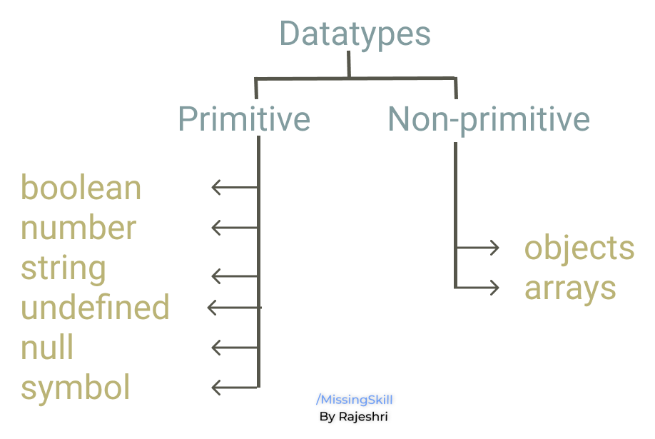

↩️ [Home directory](https://github.com/rajeshrideshmukh/missingskill-learning "Go to Home repository")

&nbsp;

# JavaScript Basic Concepts

## 📌 Operators

1. Arithmetic Operators
   
    |   Operator|	Description	|
    |-----------|---------------|
    |+	|Performs additon when both operands and number |
    |+	|Performs concatenation when alteast one of the operand is string|
    |-	|Substraction	|
    |*	|Multiplaction|
    |/	|Division	|
    |%	|Modulus operator returns remainder|
    |** | Exponentiation

<br>

2. Comparison Operators
   
    |   Operator|	Description	|
    |-----------|---------------|
    |==	| Loose equality operator compares the value of both operands	|
    |===	| Strict equality operator first check datatype of varaiable and then value gives output as boolean value	|
    |!=	|Not Equal	|
    |>	|Greater than|
    |<	|Less than	|
    |>=	|Greater than equal to|	
    |<=	|Less than equal to	a |

<br>

3. Assignment Operator
   
    |   Operator|	Description	|
    |-----------|---------------|
    | =	| It will assign right operand value to left operand <br> ```a = 5; // a will be assigned value as 5.```|
    |+=	|Shorthand for <br> ```a = a + 5 //can be wriiten as a+=5 ```|
    |-=	|Shorthand for <br> ```a = a - 5 //can be wriiten as a-=5 ```	|
    |*=	|Shorthand for <br> ```a = a * 5 //can be wriiten as a*=5 ```|
    |/=	|Shorthand for <br> ```a = a / 5 //can be wriiten as a/=5 ```	|

<br>

4. Logical Operator
   
    |   Operator|	Description	|
    |-----------|---------------|
    | &&	| Performs logical AND operation <br> ```true && false // -> false.``` <br> ```(a>0 && a<10)```| 
    |\|\|	|Performs logical OR operation <br> ``` true \|\| false // -> true```<br> ```(a>0 \|\| a<10)```|
    |!	|Performs logical NOT operation <br> ``` !true // false ```	|

<br>

5. Ternary Operator

    The ternary/conditional operator takes three operands:
    - a condition followed by a question mark ( ? ), 
    - then an expression to execute if the condition is truthy followed by a colon ( : ), 
    - and finally the expression to execute if the condition is falsy.

        Syntax :-
        ```
            [Condition] ? [Expression1] : [Expression2];
        ```

        > ❗ _Ternary operator could also be used as a shorthand technique for some if else statements_

        ```
                let value = 99;
                let isSmall;
                if (value > 100) {
                isSmall = false;
                } else {
                isSmall = true;
                }

                //Above code could be shorten into the below code
                isSmall = value > 100 ? false : true;
                console.log(isSmall); //-> return true
        ```

        

        &nbsp;

6. typeof Operator
   
   This operator returns the datatype of the give operand in the form of string. The operand can be any object, function, or variable.

     Syntax :-

    ```
        typeof operand
    ```
    ```
    console.log(typeof true); //-> boolean
    console.log(typeof "true");//-> string
    console.log(typeof 100.0);//-> number
    ```

    


## 📌 Tech Debt

## 📌 Variables

Variables are considered as a container to hold some values. 

In JavaScript, variables are loosely coupled. It means while we declare a variable we dont need to specify it's type. A JavaScript variable can be assigned any type of value and depending on the value the type is assigned at run time.

```
var a; //this is called declaration

a = 1000; //this is called assignment

a = true; //Can assign different type of data in same variable.
```

>  _❗&nbsp; In JavaScript, if a variable has been declared, but has not been assigned a value explicitly, is automatically assigned the value **undefined**._

## Naming Conventions for JavaScript Variables

-  must start with a letter, underscore (_), or dollar sign ($).
-  cannot start with a number.
-  can only contain alpha-numeric characters (A-z, 0-9) and underscores.
-  cannot contain spaces.
-  cannot be a JavaScript keyword or a JavaScript reserved word.

    In JavaScript, variables can be created using three keywords:

    &emsp;&emsp;&emsp;🔸 **var** 

    &emsp;&emsp;&emsp;🔸 **let**

    &emsp;&emsp;&emsp;🔸 **const**


    <br>

    |Points                 | var | let | const |
    |----                   |----|----|-----|
    | Can be Re-declared    | ✔️ | ❌ | ❌ |
    | Can be Re-initialized | ✔️ | ✔️ | ❌ |
    | Can be hoisted        | ✔️ | ❌ | ❌ |
    |  Blocked Scope        | ❌ | ✔️ | ✔️ |

    <br>

    > _❗ &nbsp;Use meaningful names for declaring variables and do not add uneeded context._

    

    


## 📌 Datatypes

Datatypes can be divided into two main types:

&emsp;&emsp;&emsp;🔸 **Primitive** 

&emsp;&emsp;&emsp;🔸 **Non-primitive**




<br>
<br>

## Primitive types : 
 
|   Datatype|	Description	|
|-----------|---------------|
| boolean	| Stores boolean value i.e. true & false <br> ``` var isValid = true; // isValid is a boolean variable.```|
| number	|Stores numeric value for <br> ```var age = 23 ```|
| string	| Stores sequence of characters. <br> Anything enclosed within " " is considered as string. ``` var name = "Alex"  ```	|
| undefined	| It means value is not assigned. <br> ``` var total; // total is undefined ```|
| null	|It represents empty value. <br> ```var result = null; ```	|

<br>

## Non-primitive types : 
 
|   Datatype|	Description	|
|-----------|---------------|
| object	| Represents collection of primitive and non-primitive values. <br> Stored in key value pairs. To access the value we should use ./[] <br> ``` var person = { name : "Alex" , age : 23}; ``` <br> ``` console.log(person.age); // -> 23 ``` |
| array	| Stores more than one value or a group of values under a single variable. To access members of array use index with []. <br> ```var fruits = ["Apple", "Banana", "Mango", "Orange", "Papaya"];``` <br> ``` console.log(fruits[2]); // -> Mango```|

## 📌 Pass by Value V/s Pass by Reference

- All primitive values in JavaScript are passed by value. Passing by value means that every time you assign a value to a variable, a copy of that value is created.

    ```
    let a = 1;
    let b = a;

    b = b + 2;

    console.log(a); // 1
    console.log(b); // 3

    ```

    >_Here a & b are independent of each other and therefore after updating b's value, it did not affect value of a._


- And all non-primitive types like plain objects, array, functions are pass by references. If you modify the object, then all variables that reference that object are going to see the change.

    ```
    let a = [1];
    let b = x;

    b.push(2);

    console.log(a); // [1, 2]
    console.log(b); // [1, 2]
    ```
    >_Here a & b contains same reference of the array and therefore after updating b's value, it affects value of a._

<br>

<br>

[⬆️ back on top](#javascript-basic-concepts)

↩️ [Home directory](https://github.com/rajeshrideshmukh/missingskill-learning "Go to Home repository")

&nbsp;
