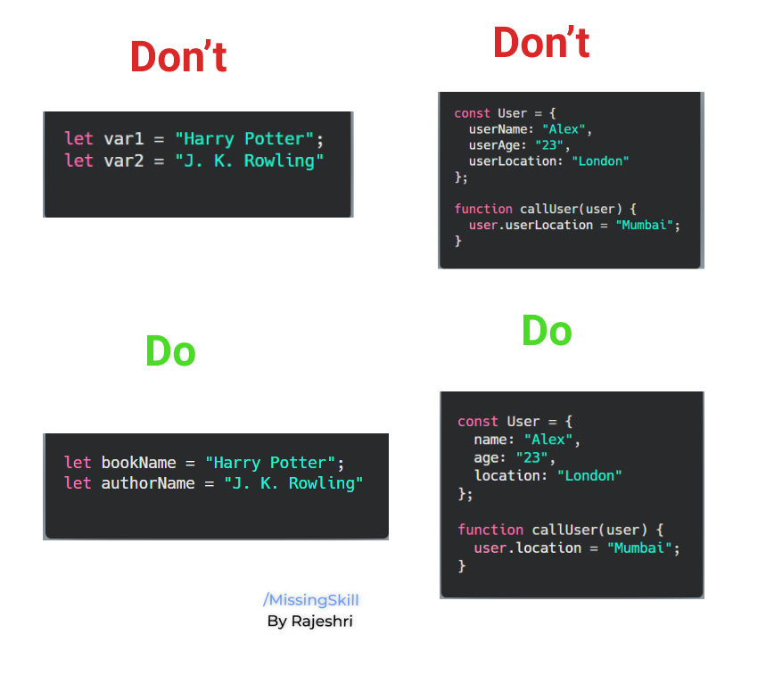
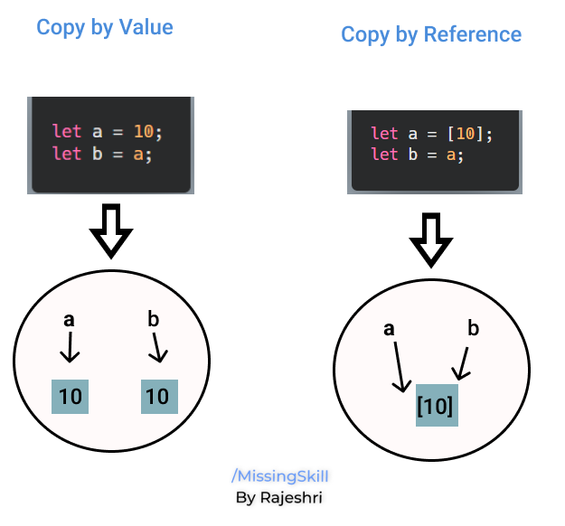

↩️ [Home directory](https://github.com/rajeshrideshmukh/missingskill-learning "Go to Home repository")

 

# 📌Introduction

JavaScript is one of the most commonly used languages. It was mainly designed to add interactivity to the web pages. It is primarily a client-side language, it runs on your computer within your browser.
Almost 95% of websites today are build using JavaScript, which also inlcudes big websites like Facebook and YouTube.

JavaScript is one of the three core languages used to develop websites. Whereas HTML and CSS give a website structure and style, JavaScript lets you add functionality and behaviors to your website, allowing your website’s users to interact with great user experience.

JavaScript code does not needs to be compiled, it is interpreted at run time, making it much more dynamic.

## Why to Use ?

 When you visit a web page in your browser, you are running it's code i.e. the HTML, CSS, and JavaScript. This code runs inside an execution environment which is our browser tab. Consider this scenario like a factory which will take raw materials (the code) and outputs a product (the web page).
- Speed : Client-side JavaScript is very fast because it can immediately run on the client's browser.
- Rich User Interface : JavaScript makes the UI of web application's look and feel much better.
- Server Load : Since it runs on client's browser, it reduces load on the web server.
- Enhanced Interaction : JavaScript adds interactivty on static pages and makes them react to user input.
- Modification : JavaScript can modify the content of a web page dyanamically, it can also change the style, position, color of the elements on the web page.
- Validation : JavaScript is used to perform validation checks on the user inputs before they are sent to the server.

<br>

# JavaScript Basic Concepts

## 📌 Operators

1. Arithmetic Operators
   
    |   Operator|	Description	|
    |-----------|---------------|
    |+	|Performs additon when both operands and number |
    |+	|Performs concatenation when alteast one of the operand is string|
    |-	|Substraction	|
    |*	|Multiplaction|
    |/	|Division	|
    |%	|Modulus operator returns remainder|
    |** | Exponentiation

<br>

2. Comparison Operators
   
    |   Operator|	Description	|
    |-----------|---------------|
    |==	| Loose equality operator compares the value of both operands	|
    |===	| Strict equality operator first check datatype of varaiable and then value	|
    |!=	|Not Equal	|
    |>	|Greater than|
    |<	|Less than	|
    |>=	|Greater than equal to|	
    |<=	|Less than equal to	a |

<br>

3. Assignment Operator
   
    |   Operator|	Description	|
    |-----------|---------------|
    | =	| It will assign right operand value to left operand <br> ```a = 5; // a will be assigned value as 5.```|
    |+=	|Shorthand for <br> ```a = a + 5 //can be wriiten as a+=5 ```|
    |-=	|Shorthand for <br> ```a = a - 5 //can be wriiten as a-=5 ```	|
    |*=	|Shorthand for <br> ```a = a * 5 //can be wriiten as a*=5 ```|
    |/=	|Shorthand for <br> ```a = a / 5 //can be wriiten as a/=5 ```	|

<br>

4. Logical Operator
   
    |   Operator|	Description	|
    |-----------|---------------|
    | &&	| Performs logical AND operation <br> ```true && false // -> false.``` <br> ```(a>0 && a<10)```| 
    |\|\|	|Performs logical OR operation <br> ``` true \|\| false // -> true```<br> ```(a>0 \|\| a<10)```|
    |!	|Performs logical NOT operation <br> ``` !true // false ```	|

<br>

5. Ternary Operator

    The ternary/conditional operator takes three operands:
    - a condition followed by a question mark ( ? ), 
    - then an expression to execute if the condition is truthy followed by a colon ( : ), 
    - and finally the expression to execute if the condition is falsy.

        Syntax :-
        ```
            [Condition] ? [Expression1] : [Expression2];
        ```

        > ❗ _Ternary operator could also be used as a shorthand technique for some if else statements_

        ```javascript
                let value = 99;
                let isSmall;
                if (value > 100) {
                isSmall = false;
                } else {
                isSmall = true;
                }

                //Above code could be shorten into the below code
                isSmall = value > 100 ? false : true;
                console.log(isSmall); //-> return true
        ```

        &nbsp;

6. typeof Operator
   
   This operator returns the datatype of the give operand in the form of string. The operand can be any object, function, or variable.

     Syntax :-

    ```javascript
        typeof operand
    ```
    ```
    console.log(typeof true); //-> boolean
    console.log(typeof "true");//-> string
    console.log(typeof 100.0);//-> number
    ```


[⬆️ back on top](#)

<br>

## 📌 Variables

Variables are considered as a container to hold some values. 

In JavaScript, variables are loosely coupled. It means while we declare a variable we dont need to specify it's type. 

A JavaScript variable can be assigned any type of value and depending on the value the type is assigned at run time.

```javascript
var a; //this is called declaration

a = 1000; //this is called assignment

a = true; //Can assign different type of data in same variable.
```

>  _❗&nbsp; In JavaScript, if a variable has been declared, but has not been assigned a value explicitly, is automatically assigned the value **undefined**._

### In JavaScript, variables can be created using three keywords:


&emsp;&emsp;&emsp;🔸 **var** 

&emsp;&emsp;&emsp;🔸 **let**

&emsp;&emsp;&emsp;🔸 **const**


<br>

|Points                 | var | let | const |
|----                   |----|----|-----|
| Can be Re-declared    | ✔️ | ❌ | ❌ |
| Can be Re-initialized | ✔️ | ✔️ | ❌ |
| Can be hoisted        | ✔️ | ❌ | ❌ |
|  Blocked Scope        | ❌ | ✔️ | ✔️ |

<br>

> _❗ &nbsp;Use meaningful names for declaring variables and do not add uneeded context._



<br>

[⬆️ back on top](#)
<br>
## 📌 Datatypes

Datatypes can be divided into two main types:

&emsp;&emsp;&emsp;🔸 **Primitive** 

&emsp;&emsp;&emsp;🔸 **Non-primitive**


<br>

## Primitive types : 
 
|   Datatype|	Description	|
|-----------|---------------|
| boolean	| Stores boolean value i.e. true & false <br> ``` var isValid = true; // isValid is a boolean variable.```|
| number	|Stores numeric value for <br> ```var age = 23 ```|
| string	| Stores sequence of characters. <br> Anything enclosed within " " is considered as string. ``` var name = "Alex"  ```	|
| undefined	| It means value is not assigned. <br> ``` var total; // total is undefined ```|
| null	|It represents empty value. <br> ```var result = null; ```	|

> To convert any value to a number datatype, preceed it with '+' 
```javascript
let a = "10";
console.log(typeof +a, +a); //Number 10
let b = "hello";
console.log(typeof +b, +b); //Number NaN

```
> To convert any value to a boolean datatype, preceed it with '!!' 
```javascript
let a = "10";
console.log(typeof +a, +a); //Boolean true
let b = {};
console.log(typeof +b, +b); //Boolean false
```

<br>

## Non-primitive types : 
 
|   Datatype|	Description	|
|-----------|---------------|
| object	| Represents collection of primitive and non-primitive values. <br> Stored in key value pairs. To access the value we should use ./[] <br> ``` var person = { name : "Alex" , age : 23}; ``` <br> ``` console.log(person.age); // -> 23 ``` |
| array	| Stores more than one value or a group of values under a single variable. To access members of array use index with []. <br> ```var fruits = ["Apple", "Banana", "Mango", "Orange", "Papaya"];``` <br> ``` console.log(fruits[2]); // -> Mango```|

## 📌 Pass by Value V/s Pass by Reference

- All primitive values in JavaScript are passed by value. Passing by value means that every time you assign a value to a variable, a copy of that value is created.

    ```javascript
    let a = 1;
    let b = a;

    b = b + 2;

    console.log(a); // 1
    console.log(b); // 3

    ```

    >_Here a & b are independent of each other and therefore after updating b's value, it did not affect value of a._


- And all non-primitive types like plain objects, array, functions are pass by references. Whenever you create non-primitive variable and assign a value to it, that variable will not store the value directly instead the value will be stored in a memory location, and this variable will pont to that memory location.

    If you modify the object, then all variables that reference that object are going to see the change.

    ```javascript
    let a = [1];
    let b = x;

    b.push(2);

    console.log(a); // [1, 2]
    console.log(b); // [1, 2]
    ```
    >_Here a & b contains same reference of the array and therefore after updating b's value, it affects value of a._

    <br>

    


<br>

[⬆️ back on top](#)

↩️ [Home directory](https://github.com/rajeshrideshmukh/missingskill-learning "Go to Home repository")
