# 📌Introduction

**Operating System** _(OS)_ is a software that manages all the system processes and it contains a kernel which performs all the task that are assigned by the OS.

So, Linux is basically a Kernel and **not an operating system**. It acts as an interface between the user application and the hardware.

> ❗ _A kernel is a software that is present at the center of an operating system. And it's task is to manage all the operations of computer and hardware._

# History

The name '**Linux**' comes from the name of it's developer i.e. Linus Torvalds.

- In 1970, Bell Lab developed an operating system called "**UNIX**"
- In 1977, some researchers from University of California, Berkeley along with previous employees of Bell Lab came together to create BSD (Berkeley Software Distribution).
  BSD was a licensed OS which was more cheaper tha UNIX.
- In 1985, Richard Stallman created a `non-proprietary` version of UNIX name GNU. HURD was the kernel of GNU which later did not receieve great response.
- In 1990, Bell Lab filed a legal defamation case on BSD stating that they stole their code.

  Meanwhile, Linus Torvalds created his own free kernel which was written in C.

- In 1991, Richard Stallman & Linus Torvalds came together to create a firm GNU/Linux which was open source and completely free.

> ❗ _Non-proprietary software - A software that has no patent or copyright conditions associated with it._

# 📌 Why to Use ?

## 🔵 Open source

    Linux is freely available to anyone.
    It is open source, that means the source code of Linux is available and accessible for use, modification and even distribution
    with it's original rights by anyone and for any purpose.

## 🔵 Linux Distribution

    A Linux distribution, also called as Linux distro, is an operating system compiled from components developed by various
    open source projects and programmers.

    Because it is open source software, anyone can make their own Linux distribution by assembling it from the source code
    themselves, or by modifying an existing distribution.

     Around 600 + Linux Distributions are available and some of the popular Linux distributions are:

        🔸 Debian
        🔸 Ubuntu
        🔸 Linux Mint
        🔸 Red Hat Enterprise
        🔸 Fedora
        🔸 CentOS

> ❗ _\*nix denotes all distrubution inspired from Unix which include FreeBSD, FreeBSD, etc._

[⬆️ back on top](#)

# 📌 Linux Commands

Linux's shell/terminal is the main part. All the commands are performed in the shell of Linux.

A shell is basically a program that receives commands from the user and gives it to the OS to process, and it shows the output. Linux has a CLI (command line interface).

> ❗ _All the following commands are performed on GitBash._

1.  **ls**
    -> To list all files and directories that are present in the current directory.

    &nbsp;

    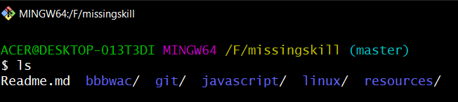

    **ls command with flags** :

    - _ls -a_ : To show the hidden files
    - _ls -l_ : To show the list in more detail like access permission, size, ownwer, etc.
    - _ls -h_ : To show file size in human readable format.
    - _ls -t_ : To sort the list in ascending order of the modification time.
    - _ls -r_ : To show the list in reverse order.

      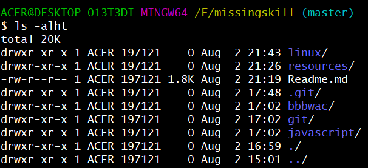

      > ❗ _files starting with '-rw-r' indicates a file_

      > ❗ _files starting with 'drwxr' indicates a directory_

    &nbsp;

2.  **cd**
    -> To jump from one directory to other.

    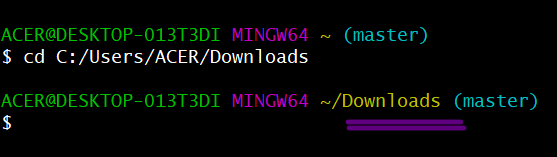

    **cd command with other options** :

    - _cd -_ : To jump to previously visited directory.

      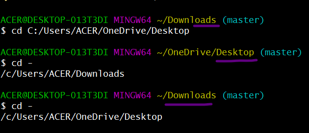

    - _cd .._ : To jump one directory back

      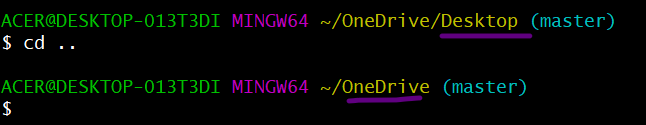

    - _cd / cd ~_ : To jump directly into home directory.

      

      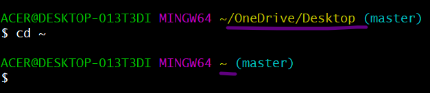

    - _cd /_ : To jump directly into root directory.

      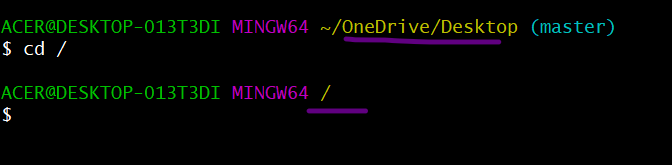

    &nbsp;

3.  **pwd** -> To show the path of current working directory

    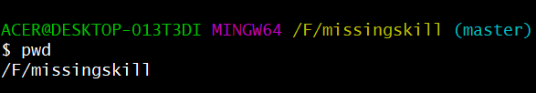

    &nbsp;

4.  **touch** -> To create a blank file

    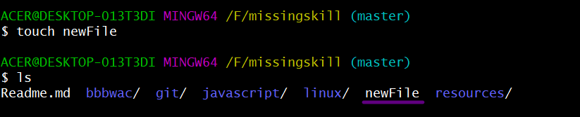

    > ❗ _touch .fileName creates hidden file_

    &nbsp;

5.  **cat** -> To add, update or view content from a file.
    **cat command with other options** :

    - _cat > [filename]_ : Add the content into the file.

      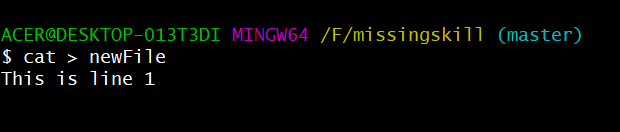

    - _cat [filename]_ : View the content from the file

      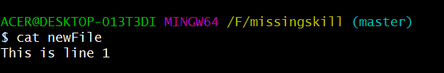

    - _cat >> [filename]_ : Update the content of the file.

      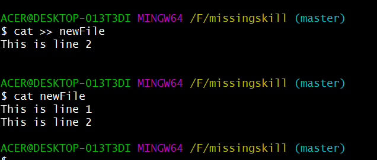

      > ❗ _Press Ctrl + C to exit from editor._

    &nbsp;

6.  **mkdir** -> To create a new directory.

    - _mkdir [directoryName]_ : Creates new directory

      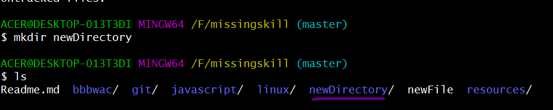

    - _mkdir [directoryName1] [directoryName2] [directoryName3]_ : Creates multiple folder in current directory

      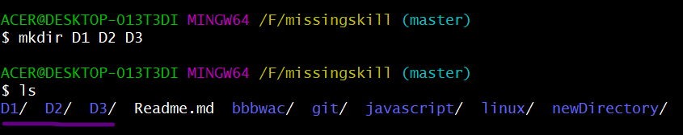

    - _mkdir [folderName1/folderName2/folderName3] -p_ : Creates sub-directories inside directories.

      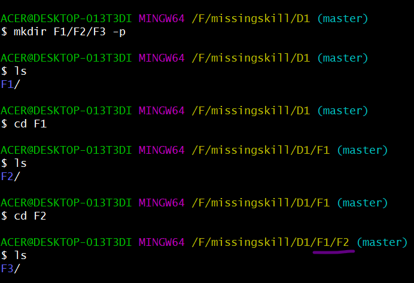

    &nbsp;

7.  **rmdir** -> To delete an existing directory.

    

    > ⚠️ _Not performs delete operation if directory is not empty ._

    &nbsp;

8.  **rm** -> To remove file.

    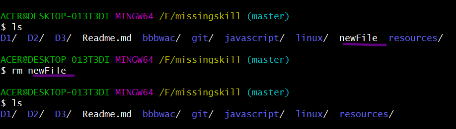

    - _rm -r [directoryName]_ : Delete files and directories recursively.
    - _rm -f [fileName]_ : Remove files forcebly.
    - _rm \*_ : Remove all files from the current directory.

       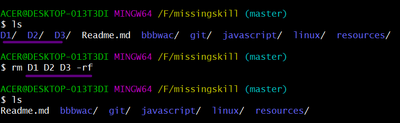

9.  **mv** -> To move a file from source to destination path.

    - mv [fileName] [destinationPath]

       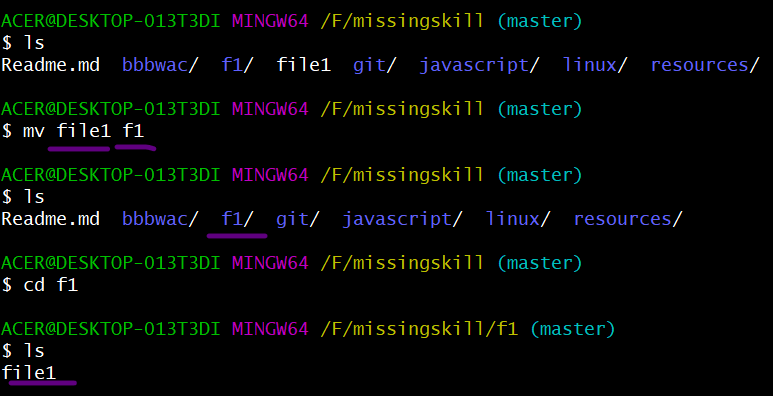

    > ❗ _mv can also be used for renaming a file -> mv [fileName] [newfileName]_

    &nbsp;

10. **cp** -> To copy an existing file to a new destination path.

    - _cp [filename1] [newfilename]_
    - _cp [filename1] [newfilename] [destinationPath]_

      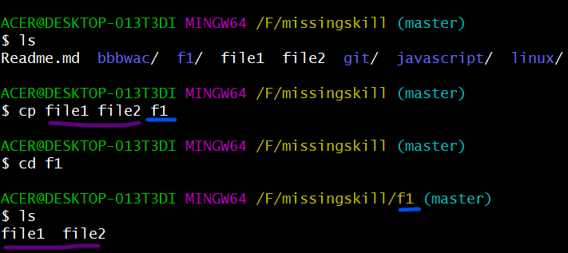
    &nbsp;

11. **history** -> To list all the previously performed commands.

     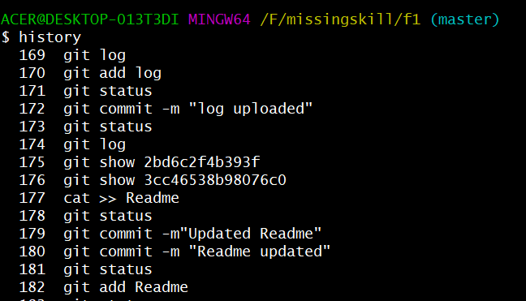
    &nbsp;

12. **echo** -> To display message on terminal.

     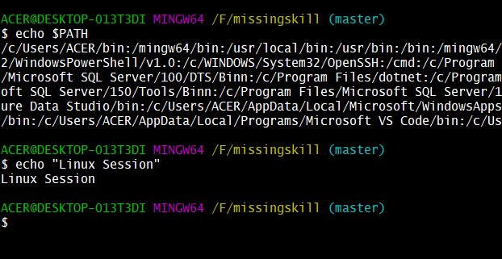
    &nbsp;

13. **who** -> To display currently logged-in users in the system.

    - **whoami** -> To display the username of the current user.

      
    &nbsp;

14. **ping** -> To check your connection to a server.

      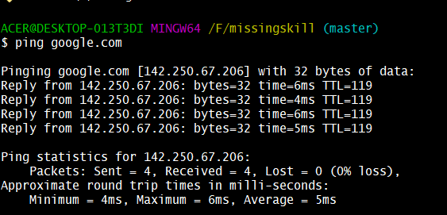

    &nbsp;

15. **ipconfig/ifconfig** -> To display the configuration of system.

     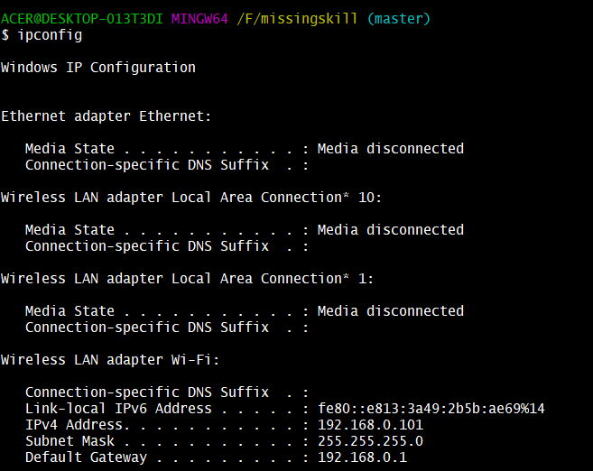

    > ❗ _ifconfig is used in Unix-like OS_

    &nbsp;

16. **which** -> To locate the executable file of the given command.

    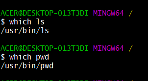

    &nbsp;

17. **ps** -> To display all running application.

    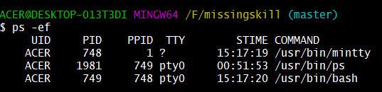

    &nbsp;

18. **nano** -> Nano is and in-built installed text editors in the Linux command line.

    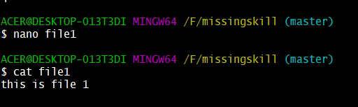

    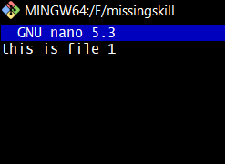

> ❗ _Save your files after editing by using the sequence Ctrl+X, then Y (or N for no)_

&nbsp;

17. **man & help** -> To know more about a command and how to use it.

    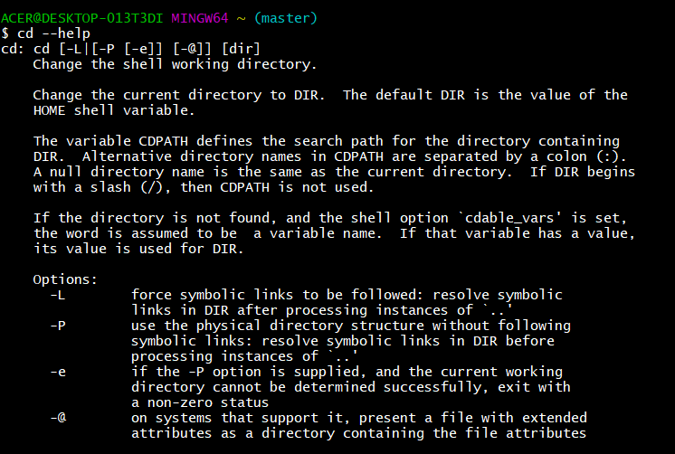

&nbsp;

18. **top** -> To display a list of all the running processes along with their CPU uages.

19. **more/less** ->

    - more : To display the whole content from a file.
    - less : To display content of files with help of pagination.

20. **wget** -> To display command line browser.

21. **clear** -> To clear the terminal if it gets filled up with too many commands.

> ❗ _Shortcut for clear command - Ctrl + L_

22. **exit** -> To exit from the terminal.

[⬆️ back on top](#)

# 📌 Linux File System

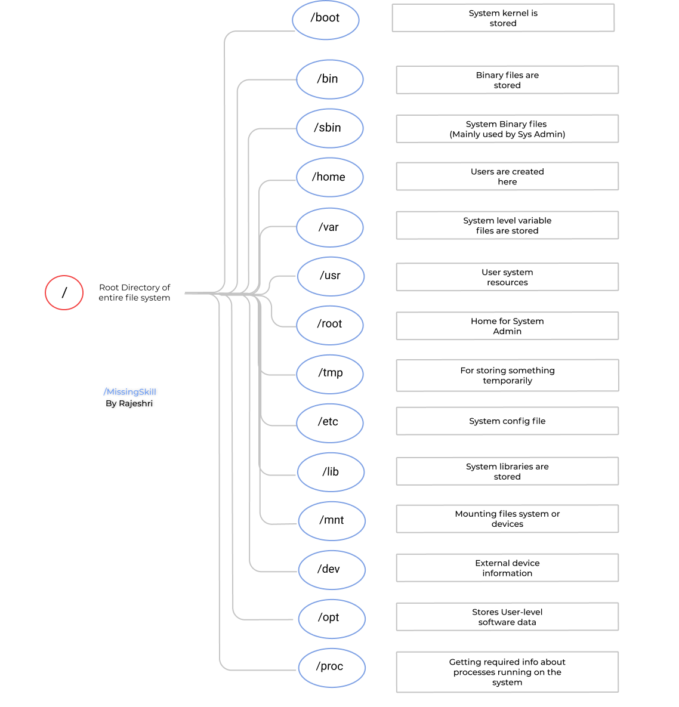

[⬆️ back on top](#)
